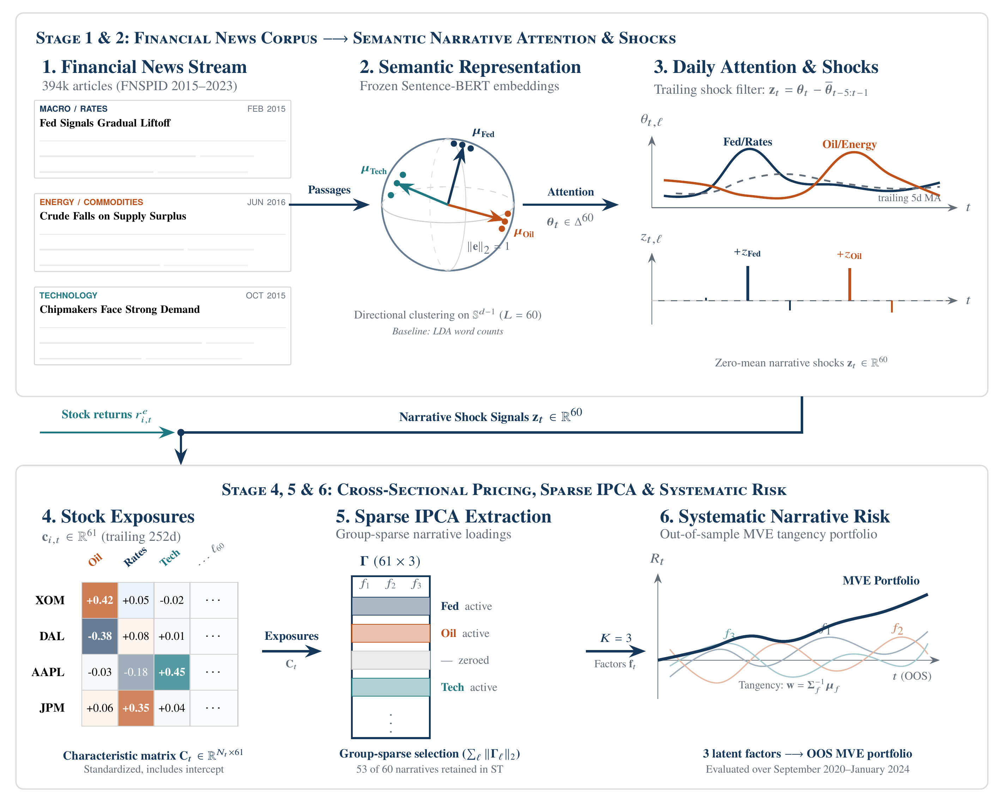

# From Word Counts to Context: Topic Models for Asset Pricing

Reproducibility package for the working paper **From Word Counts to Context:
Topic Models for Asset Pricing** by Kevin Foley, Jonathan Hartadi, Shivesh
Prakash, and Swapnil Vatsal (UC Berkeley, 2026).

**[Read the paper](main.pdf)** · **[Project Webpage](https://shivesh777.github.io/bert_lda/)** · **[Run the pipeline](#running-the-main-model)** ·
**[Verify the archived results](#what-is-included)**



The pipeline turns financial news into daily narrative
attention with two text layers (LDA and a frozen sentence transformer),
converts attention into narrative shocks and stock-level covariance
instruments, and prices the cross-section with sparse IPCA following
Bybee, Kelly and Su (2023). The main model uses L = 60 topics and K = 3
factors. `ablation/` holds the topic-count study reported in Appendix B.

## At a glance

- **Corpus:** 394,661 FNSPID financial-news articles, 2015–2023
- **Controlled comparison:** LDA vs. frozen Sentence-BERT with the same
  downstream asset-pricing pipeline
- **Evaluation:** topic coherence (NPMI) and 41 monthly out-of-sample returns
- **Main finding:** Frozen ST has higher observed coherence and OOS Sharpe;
  the available tests do not establish outperformance
- **Exploratory result:** spherical topics with multi-horizon exposures reach
  an observed excess-return Sharpe of 1.03

## Layout

```
config.py                    all settings (defaults are the paper's values)
run_main.py                  runs the main pipeline end to end, resumable
main.pdf                     working paper
assets/figure1_pipeline.png  paper's end-to-end architecture figure
scripts/
  download_fnspid.py         stream FNSPID from Hugging Face, filter to 2015-2023
  prepare_corpus.py          dedupe, 120 articles per day  -> data/corpus.parquet
  build_vocab_and_chunks.py  shared vocabulary, count matrix, passages
  fit_lda.py                 LDA (tomotopy, 800 Gibbs sweeps)
  embed_chunks.py            frozen paraphrase-MiniLM-L3-v2 embeddings
  fit_transformer_topics.py  k-means / spherical k-means topics, c-TF-IDF terms
  coherence.py               NPMI per topic
  compare_topic_models.py    soft vs sparse-soft head: same attention, new terms
  price_single_horizon.py    shocks -> covariances (half-life 60) -> sparse IPCA -> OOS
  price_multi_horizon.py     half-lives 20/60/120, grouped penalty, excess returns
  wrds_pull.py               CRSP universe and returns (needs WRDS access)
src/                         pipeline modules used by the scripts
tests/                       synthetic smoke tests, no data needed
results/                     fitted weights and outputs, main runs and the sweep fits
ablation/                    topic-count sweep and L = 80 pricing (Appendix B)
data/vocab.json              the 15,000-term vocabulary of the main runs
data/vocab_ablation.json     the vocabulary of the sweep fits
```

## Setup

Use Python 3.11. A virtual environment is recommended:

```bash
python -m venv .venv
source .venv/bin/activate
pip install -r requirements.txt
python tests/smoke_test.py            # about one minute, no data required
python tests/topic_clustering_test.py
```

A CUDA build of PyTorch makes embedding and spherical clustering much
faster; `run_main.py --device auto` (the default) uses it when present and
`--device cpu` forces CPU. Everything also runs on CPU.

## Data

FNSPID news (Dong et al., 2024) is public and downloaded by
`scripts/download_fnspid.py` from
`huggingface.co/datasets/Zihan1004/FNSPID` (`Stock_news/nasdaq_exteral_data.csv`,
23 GB streamed, about 2 GB kept). The script checks that every worker read
its full byte range.

CRSP daily returns are licensed and not included. `scripts/wrds_pull.py`
reproduces the panel from WRDS: common shares on NYSE, AMEX and NASDAQ,
the 1,000 largest stocks by June market capitalisation each year (kept for
that calendar year), 2014-2024, written to `data/crsp_daily_2014_2024.parquet`
with columns `date, permno, ticker, ret, prc, shrout, me`.

The Fama-French daily factor file (for the risk-free rate) is downloaded by
`run_main.py` into `data/external/`.

## Running the main model

```bash
python run_main.py                         # steps 1-7: corpus, topics, coherence
python run_main.py --crsp data/crsp_daily_2014_2024.parquet   # adds the pricing stages
```

Steps and approximate times on a 4-core machine with a T4 GPU:

| step | script | time |
|---|---|---|
| download FNSPID | download_fnspid.py | 5-10 min |
| corpus (dedupe, per-day cap) | prepare_corpus.py | 1 min |
| vocabulary, counts, passages | build_vocab_and_chunks.py | 6 min |
| LDA, 800 Gibbs sweeps | fit_lda.py | 60 min |
| passage embeddings | embed_chunks.py | 12 min (GPU) |
| transformer topics, three variants | fit_transformer_topics.py | 2 min each |
| coherence | coherence.py | 1 min |
| single-horizon pricing, per variant | price_single_horizon.py | 45 min |
| multi-horizon pricing, per variant | price_multi_horizon.py | 2 h |

Every step writes checkpoints and is skipped on rerun once its outputs
exist, so `run_main.py` can be restarted after an interruption. For the
same reason a fresh run starts from an empty `results/`: move the stored
`results/` and `data/vocab.json` aside first, and `run_main.py` will say so
if they are still in place. The ablation scripts skip finished fits the
same way.

The three transformer variants are named as in the paper:

| variant | clustering | term head | paper |
|---|---|---|---|
| `st_frozen` | mini-batch k-means | hard | Frozen ST (Table 1, rows 2-3) |
| `st_spherical_soft` | spherical k-means | soft | full-soft control (Section 3.5) |
| `st_spherical` | same centroids as above | sparse-soft | Spherical ST (Table 1, row 4) |

`st_spherical` reuses the centroids of `st_spherical_soft`, so the two share
daily attention and differ only in their term lists;
`compare_topic_models.py --require-same-attention` verifies this.

To run a stage by hand, call the script directly; each one documents its
arguments at the top of the file. Settings live in `config.py`; the
environment variables `TOPIC_L`, `LDA_GIBBS_ITERS`, `SWEEP_L` and
`TOPIC_CLUSTER_DEVICE` override the corresponding entries (the sweep uses
`TOPIC_L`), and `OUT_SUFFIX` renames the outputs of
`price_single_horizon.py`.

## Outputs

Stage 1 writes, per variant, `results/theta_daily_{v}.parquet` (daily
attention, 3,285 days x L, rows sum to one), `phi_{v}.npy` (topic-term
distributions over the vocabulary), `centroids_{v}.npy` (transformer
variants), `labels_{v}.json` and `meta_{v}.json`. `coherence.py` writes the
per-topic NPMI to `results/coherence.json`.

The pricing scripts write the tuned selection (`selection_*.csv`), the
monthly OOS portfolio returns (`oos_*.parquet`) and a `summary_*.json` with
the OOS Sharpe ratio (the single-horizon summaries also hold the in-sample
Sharpe ratio; the multi-horizon runs put per-refit details in
`diagnostics.json`). The reported values (Table 1 of the
paper; OOS September 2020 to January 2024, 41 months) are:

| specification | returns | mean NPMI | OOS Sharpe |
|---|---|---:|---:|
| LDA, single horizon | total | 0.2875 | -0.0810 |
| Frozen ST, single horizon | total | 0.3469 | 0.3059 |
| Frozen ST, multi-horizon | excess | 0.3469 | 0.6605 |
| Spherical ST, sparse-soft, multi-horizon | excess | 0.4691 | 1.0334 |

## What is included

`results/` holds, for the main L = 60 runs, the four summaries above, the
per-topic coherence, labels and metadata of every variant, the OOS return
series of every pricing run, and the fitted weights (`theta_daily`, `phi`)
of the LDA and frozen ST layers. The spherical L = 60 weights are not in
the archive and are regenerated by `run_main.py`; a spherical refit at
L = 60 from the sweep is included as `st_spherical_L60`.

The sweep and L = 80 fits are included in full, next to the main files with
an `_L{L}` suffix: `theta_daily`, `phi`, `centroids`, `labels` and `meta`
for `lda`, `st_spherical_soft` and `st_spherical` at L = 50, 60, 70 and 80,
and every L = 80 pricing output (selection, OOS returns, summaries,
multi-horizon diagnostics) under `ablation/results/`.

Not included: the FNSPID download and corpus, the count matrix, passages
and embeddings (all rebuilt by the pipeline), the CRSP panel (licensed),
the LDA Gibbs checkpoints and the frozen ST centroids. Some stored metadata
files were written by earlier revisions of the scripts and use slightly
different key names; the values are the same.

To check the archive without rerunning anything:

```
python tests/check_results.py
```

This reloads every weight file, confirms shapes and that attention rows sum
to one, recomputes topic diversity from `phi` and the NPMI means from the
per-topic coherence file, rebuilds every topic label from `phi` and the
vocabulary, and recomputes every OOS Sharpe ratio from the stored monthly
returns, comparing them with the stored summaries and with the values
reported in the paper.

## Reproducibility notes

All random seeds are fixed (`config.SEED = 0`; the corpus subsample uses a
seeded hash). Some run-to-run variation remains: tomotopy's multithreaded
Gibbs sampler is not bit-reproducible across thread counts, GPU reductions
in the spherical clustering can differ in the last digits from CPU, and
the FNSPID download depends on `config.N_WORKERS` (keep it at 6). The
evaluation window, penalty grids and refit schedule are fixed in the
scripts and match Section 3.7.

The stored L = 60 results were produced on an earlier build of the corpus,
and a fresh run rebuilds the corpus from the same download and rules, so
regenerated L = 60 numbers can differ slightly from the stored ones. The
sweep and the L = 80 pricing were run on the rebuilt corpus, and its
vocabulary is shipped separately as `data/vocab_ablation.json` so that the
`_L{L}` topic-term files can be read.

## Ablation

`ablation/README.md` describes the topic-count sweep (L = 50, 60, 70, 80)
and the L = 80 pricing runs behind Appendix B.

## Citation

Foley, K., Hartadi, J., Prakash, S. and Vatsal, S. (2026). From Word Counts
to Context: Topic Models for Asset Pricing. Working paper.
